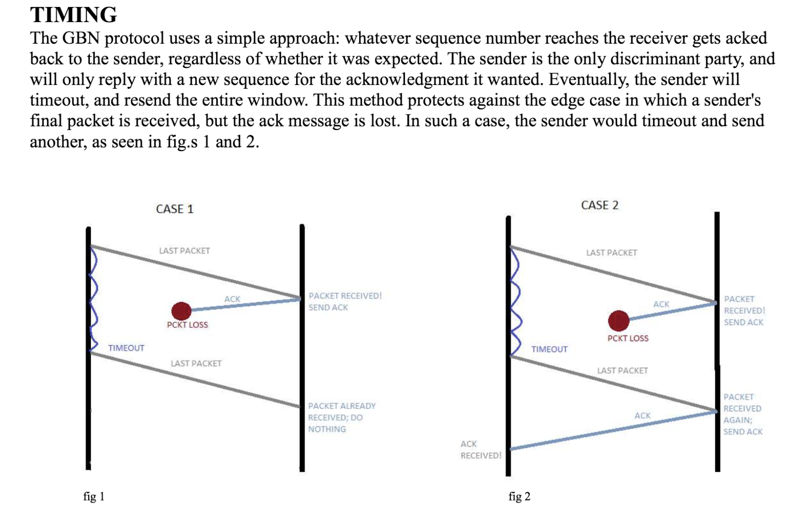

# RINGO NETWORK

The ringo network is a network of nodes (ringos) that perform packet sending on a peer-to-peer platform. 

- Authors: John (JaeMin) Baek & Thomas Jeremiah Bright
- Emails:	tbright32@gatech.edu	jbaek60@gatech.edu
- [**REPORT2.pdf	updated report describing our ringo network architecture**](REPORT2.pdf)
- Files:	
```
	ringo.py 	monolithic code base for ringo network node
	sample.txt  	examples of running the ringo network
	README.md  	this
```



# components of a ringo

	Each ringo has a ROLE it serves to the network. The possible roles are sender, forwarder, and receiver. Each network has one sender, whose job it is to send a message on the network. There is also one receiver, the intended recipient of the message. Forwarders are not necessary, but a network may contain any number of them to forward the message along.

	Each ringo also has a point of contact (PoC), the first node on the network that it knows about. 

	Both of these components are provided to the node upon creation.


# running a ringo
	
	see sample.txt

# establishing a network

	The components are provided in the form:

		ringo.py <flag> <local-port> <PoC-name> <PoC-port> <N>

	It is important that the initial node, regardless of role, be given a <poc_name> of 0 and a <poc_port> of 0, e.g.
		ringo.py R 8000 0 0 4
	Subsequent ringos may be given any PoC on the network as long as all nodes and their PoCs comprive a single graph-shaped network. The network will finish its peer discovery phase once each ringo in online.
